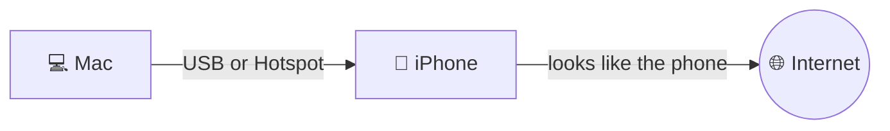

<p align="center">
  
</p>

<h1 align="center">Nothering – is not tethering</h1>

<p align="center">
  Use your iPhone's cellular connection from your Mac without it looking like tethering.
</p>

<p align="center">
  <a href="https://testflight.apple.com/join/GYV2fdtp"></a>
  <a href="https://github.com/devxoul/nothering/releases/latest"></a>
</p>

---

## What it does

Regular Personal Hotspot forwards your Mac's packets through the phone, and carriers can tell (and block, throttle, or bill) that traffic. Nothering takes a different route: the iPhone runs a small **SOCKS5 proxy**, and every connection your Mac makes is **re-opened from the iPhone's own network stack** over cellular. To the carrier, it's just the phone talking.

On the Mac, a **transparent proxy system extension** captures app traffic (TCP, UDP and DNS) and sends it to the phone over **USB** or the **Personal Hotspot** link. No per-app proxy settings needed.

## How it works



| Piece | Role |
|---|---|
| **iPhone app** | SOCKS5 server (CONNECT + framed UDP) on port `11080`. Accepts clients only from loopback and hotspot (`bridge*`) interfaces, and pins outbound connections to cellular. Plays silent audio to stay alive in the background. |
| **Mac menu bar app** | Owns the link to the phone — prefers USB, falls back to the hotspot gateway — and serves it on `127.0.0.1:11080`. Installs and toggles the extension. |
| **Mac proxy extension** | `NETransparentProxyProvider` + `NEDNSProxyProvider`. Relays outbound flows via SOCKS5; resolves public DNS over TCP through the phone. |
| **`nothering` CLI** | Minimal alternative to the menu bar app: a local SOCKS5 forwarder, optionally set as the system SOCKS proxy. |

### What goes direct

Nothering fails open — your Mac keeps working when the phone isn't around.

- 🔌 **Phone unreachable** → flows and DNS go direct.
- 🏠 **Local networks** (RFC 1918, link-local, CGNAT, ULA, multicast) are never captured.
- 🛡️ **Other VPNs / network extensions** are left alone — except Tailscale's TCP (control plane + DERP), so your tailnet keeps working when the carrier blocks WireGuard UDP. Tailnet DNS names resolve normally.

## Getting started

### Install

- **iPhone** — join the [TestFlight beta](https://testflight.apple.com/join/GYV2fdtp).
- **Mac** — download the app and CLI from [GitHub Releases](../../releases).

### Requirements

- Xcode with the iOS 18 / macOS 15 SDKs
- [Tuist](https://tuist.dev)
- An Apple Developer team (system extensions and Network Extension entitlements need signing)

### Build

```sh
tuist generate  # creates Nothering.xcworkspace
```

Set your own `teamID` (and optionally `bundleIDPrefix`) in [`Project.swift`](Project.swift) first.

| Scheme | Product |
|---|---|
| `NotheringiOS` | iPhone app |
| `NotheringMenuBar` | Mac menu bar app (embeds the extension) |
| `NotheringMac` | `nothering` CLI |
| `ProxyCore`, `PhoneLink` | Libraries + unit tests (`tuist test ProxyCore`) |

### Release

Releases go through [fastlane](https://fastlane.tools) with [match](https://docs.fastlane.tools/actions/match/) handling signing. Set these in the environment or in `fastlane/.env`:

| Variable | Purpose |
|---|---|
| `MATCH_GIT_URL`, `MATCH_PASSWORD` | Private certificates repo and its passphrase |
| `APP_STORE_CONNECT_API_KEY_KEY_ID`, `APP_STORE_CONNECT_API_KEY_ISSUER_ID`, `APP_STORE_CONNECT_API_KEY_KEY_FILEPATH` | App Store Connect API key (`.p8`) |

```sh
bundle install
bundle exec fastlane release      # both below, sharing one build number
bundle exec fastlane ios beta     # iPhone app → TestFlight (build number = latest + 1)
bundle exec fastlane mac release  # Mac app + CLI → Developer ID, notarized zips in build/fastlane/
```

`ios beta` and `mac release` accept `build_number:<n>`. Set `MATCH_READONLY=true` to stop match from creating new certificates or profiles.

Published releases go through the **Release** GitHub Actions workflow (`gh workflow run release.yml -f version=X.Y.Z`): it uploads the iPhone app to TestFlight and attaches the notarized Mac app and CLI to a GitHub Release. See [`AGENTS.md`](AGENTS.md#release) for the full process.

### Use

1. **iPhone** — open Nothering and tap **Start Proxy**.
2. **Connect** the Mac by USB cable or join the iPhone's Personal Hotspot.
3. **Mac** — launch the menu bar app. It copies itself to `/Applications` (required for system extensions) and asks to install the extension; approve it in **System Settings → General → Login Items & Extensions**.
4. Flip the switch in the menu bar panel. The icon lights up while traffic is captured.

 on &nbsp;·&nbsp;  off

The panel shows the active link, traffic counters, and lets you force **USB** or **Hotspot**. Scripts can toggle capture with URLs:

```sh
open nothering://on
open nothering://off
```

### CLI

```sh
nothering [--via auto|usb|hotspot] [--port 11080] [--host <phone address>] [--system-proxy]
```

Forwards `127.0.0.1:<port>` to the phone. `--system-proxy` sets macOS's SOCKS proxy for the duration and restores it on exit. If the process dies without cleanup:

```sh
networksetup -setsocksfirewallproxystate <service> off
```

## Project layout

```
iOS/         iPhone app (SwiftUI) — proxy controller, background keeper
ProxyCore/   Shared SOCKS5 server, local forwarder, UDP framing
PhoneLink/   Mac-side links: usbmux, hotspot gateway, SOCKS5/DNS clients
MacApp/      Menu bar app — extension controller, phone forwarder
MacProxy/    System extension — transparent proxy + DNS proxy
Mac/         `nothering` CLI
scripts/     failsafe.sh
Shared/      App icon (Icon Composer)
```

### UDP over a stream

The links to the phone only carry streams, so UDP rides inside the SOCKS5 TCP connection using a custom command (`0x83`). Each datagram is one frame:

```
length (UInt16 BE) | ATYP | address | port | payload
```

See [`DatagramFrame.swift`](ProxyCore/Sources/DatagramFrame.swift).

## Development tips

Changing network settings on your only uplink is risky. [`scripts/failsafe.sh`](scripts/failsafe.sh) applies a change and auto-reverts unless you confirm it, or if connectivity checks fail three times in a row:

```sh
scripts/failsafe.sh 'open nothering://on' 'open nothering://off' 120
# happy with it?
touch /tmp/nothering-failsafe.confirm
```

Logs use the `app.nothering` subsystem:

```sh
log stream --predicate 'subsystem == "app.nothering"'
```

## License

[MIT](LICENSE)
